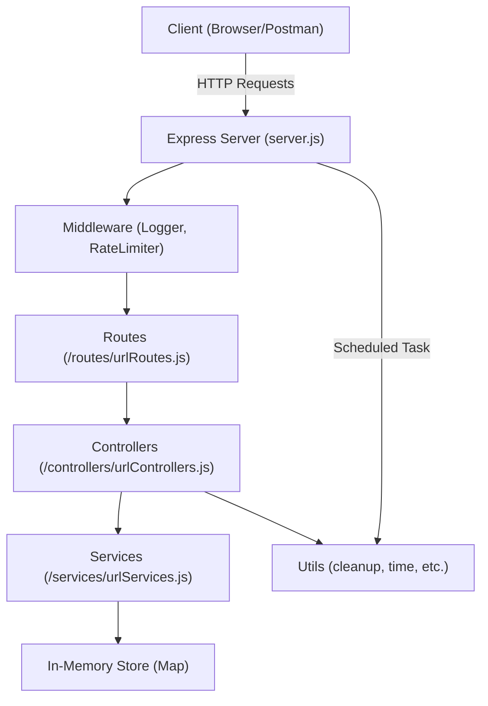

# afformed_test URL Shortener

A simple URL shortener service built with Node.js and Express. It allows users to create short links, retrieve information about them, and handles automatic cleanup of expired links.

## Features
- Create short URLs with optional custom codes and validity periods
- Redirect to original URLs using short codes
- Retrieve metadata and analytics for each short URL
- In-memory storage for fast access (no external DB required)
- Automatic cleanup of expired links every 10 minutes
- Rate limiting to prevent abuse
- Logging for key events and errors

## System Design Architecture



### Component Breakdown

- **Client:** Sends HTTP requests to the server (e.g., to create or access short URLs).
- **Express Server (`server.js`):** Entry point, sets up middleware, routes, and background tasks.
- **Middleware:** Handles logging and rate limiting for incoming requests.
- **Routes:** Maps HTTP endpoints to controller functions.
- **Controllers:** Contains business logic for creating, retrieving, and redirecting short URLs.
- **Services:** Manages the in-memory store and URL data operations.
- **In-Memory Store:** Stores all short URL data (Map object).
- **Utils:** Provides utility functions (e.g., cleanup of expired links, time calculations).
- **Background Task:** Periodically cleans up expired links using a scheduled function.

## Folder Structure
```
.
├── config/           # Configuration files (e.g., Redis client)
├── controllers/      # Request handler logic (controllers)
├── middlewares/      # Express middlewares (logger, rate limiter)
├── routes/           # API route definitions
├── services/         # Business logic, in-memory store, schemas
├── utils/            # Utility functions (cleanup, time, tokens)
├── server.js         # Main entry point
├── package.json      # Project metadata and dependencies
```

## Setup
1. **Clone the repository**
2. **Install dependencies**
   ```bash
   npm install
   ```
3. **(Optional) Create a `.env` file**
   - Set `PORT` if you want a custom port (default: 3000)
4. **Start the server**
   ```bash
   npm start
   ```

## Usage
The server exposes the following endpoints:

### 1. Create a Short URL
- **Endpoint:** `POST /shorturls/`
- **Body:**
  ```json
  {
    "url": "https://example.com",
    "validity": 60,           // (optional) validity in minutes, default 30
    "shortcode": "custom123" // (optional) custom code
  }
  ```
- **Response:**
  ```json
  {
    "shortLink": "http://localhost:3000/custom123",
    "expiry": "2024-06-01T12:00:00.000Z"
  }
  ```

### 2. Get Short URL Info
- **Endpoint:** `GET /shorturls/:shortcode`
- **Response:**
  ```json
  {
    "originalUrl": "https://example.com",
    "createdAt": "2024-06-01T11:00:00.000Z",
    "expiresAt": "2024-06-01T12:00:00.000Z",
    "clicks": 5,
    "accessLogs": [
      { "timestamp": "2024-06-01T11:05:00.000Z", "ip": "127.0.0.1" },
      ...
    ]
  }
  ```

### 3. Redirect to Original URL
- **Endpoint:** `GET /:shortcode`
- **Behavior:** Redirects to the original URL if the shortcode exists and is not expired. Returns 404 if not found, 410 if expired.

## Background Cleanup Task
- Every 10 minutes, expired short links are automatically removed from memory.
- This is handled by a background task in `utils/cleanup.js`.

## Technologies Used
- Node.js
- Express
- nanoid (for unique short codes)
- express-rate-limit (rate limiting)
- dotenv (environment variables)
- In-memory Map for storage (no DB required)

## Notes
- All data is stored in memory; restarting the server will clear all short URLs.